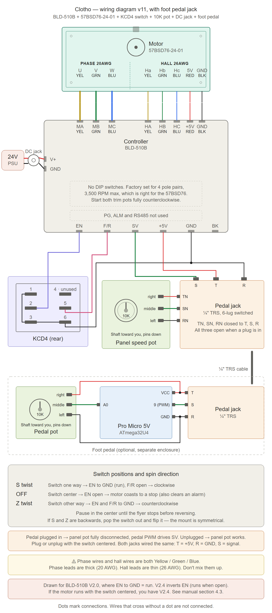

# Clotho eSpinner

**Clotho** is a 3D-printed eSpinner (electric spinning wheel).
Printable parts, build notes and photos are on Printables:
<https://www.printables.com/model/1779646-clotho-espinner>

This repo holds the CAD files, the foot pedal firmware and the wiring diagram:

- `cad/`: STEP model and 3MF print files
- `firmware/`: PlatformIO project for the foot pedal
- `docs/`: wiring diagram

The pedal has a 10K potentiometer. The firmware reads it and drives a BLD-510B brushless
motor controller with a ~1 kHz PWM speed signal. It has a calibration routine and
adjustable dead zones at the heel and toe ends, and saves both to EEPROM.

## CAD

- `cad/clotho.step`: the full assembly. Open it in any CAD program to modify or remix parts.
- `cad/*.3mf`: PrusaSlicer projects, one per assembly, ready to slice:

  | File | Part |
  |------|------|
  | `base.3mf` | Base |
  | `front-riser-assembly.3mf` | Front riser |
  | `rear-riser-assembly.3mf` | Rear riser |
  | `flyer-assembly.3mf` | Flyer |
  | `bobbin-assembly.3mf` | Bobbin |
  | `spreader-assembly.3mf` | Spreader |
  | `poly-belt-form.3mf` | Poly belt form |
  | `foot-pedal.3mf` | Foot pedal |

The 3MFs are set up for PETG on a Prusa Core One (0.4 mm nozzle, 0.20 mm STRUCTURAL).
On another printer, open them and switch to your own printer and filament profiles.
Build notes and photos are on the Printables page linked above.

## Hardware

- **Board:** SparkFun Pro Micro, **5 V / 16 MHz** (ATmega32U4). The 3.3 V / 8 MHz version
  will not work as configured: the PWM timing assumes 16 MHz.
- **Pot wiper:** A0
- **PWM out:** pin 9 (Timer1 OC1A) to the BLD-510B speed input

Full wiring (v11), in two versions:

- With the foot pedal jack: [docs/clotho_wiring_diagram.svg](docs/clotho_wiring_diagram.svg)
- Without it, with the speed pot wired straight to the driver:
  [docs/clotho_wiring_diagram_no_pedal.svg](docs/clotho_wiring_diagram_no_pedal.svg)

The older diagram on Printables shows EN and F/R tied to +5V. That is wrong. Use these.



## Build and flash

Install [PlatformIO](https://platformio.org/) (VS Code extension or CLI), connect the
Pro Micro by USB, then run these from the `firmware/` folder:

```sh
cd firmware
pio run                     # build
pio run -t upload           # build and flash
pio device monitor -b 9600  # open the serial console
```

In VS Code, open the `firmware/` folder itself so the PlatformIO extension finds the project.

## Serial commands

The serial console runs at 9600 baud. End each command with a newline. Commands are
not case-sensitive.

| Command  | What it does |
|----------|--------------|
| `CAL`    | Calibration. Move the pedal through its full range, then type `SAVE` to store the range or `CANCEL` to keep the old one. |
| `DZ`     | Dead zones. Asks for the heel-end %, then the toe-end % (each 0–50). Defaults: heel 5, toe 0. |
| `STATUS` | Shows the stored calibration min/max, the dead zones and a live ADC reading. |

Run `CAL` once after flashing. Until you do, the firmware uses the full 0–1023 ADC range.

After power-up, and after leaving `CAL` or `DZ`, the motor stays off until the pedal
returns to rest (inside the heel dead zone). If the pedal is pressed at that point, the
console prints a reminder to release it.

## License

- **Firmware** (`firmware/`): MIT. See [LICENSE](LICENSE).
- **CAD** (`cad/`), **wiring diagram** (`docs/`) and other documentation: CC BY-SA 4.0, the same as
  the Printables listing. See [LICENSE-CC-BY-SA-4.0.txt](LICENSE-CC-BY-SA-4.0.txt).
